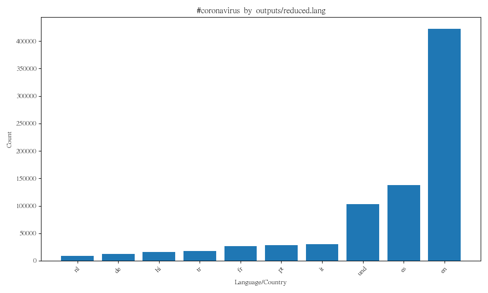
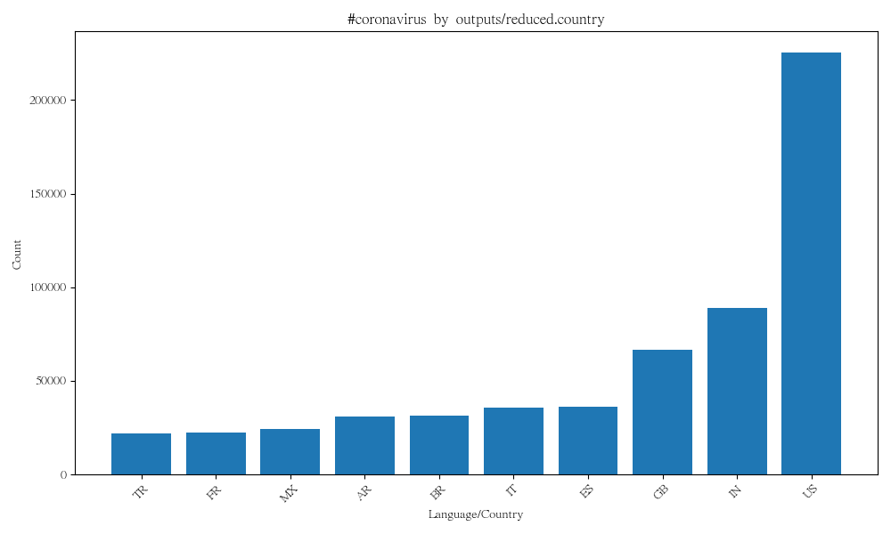
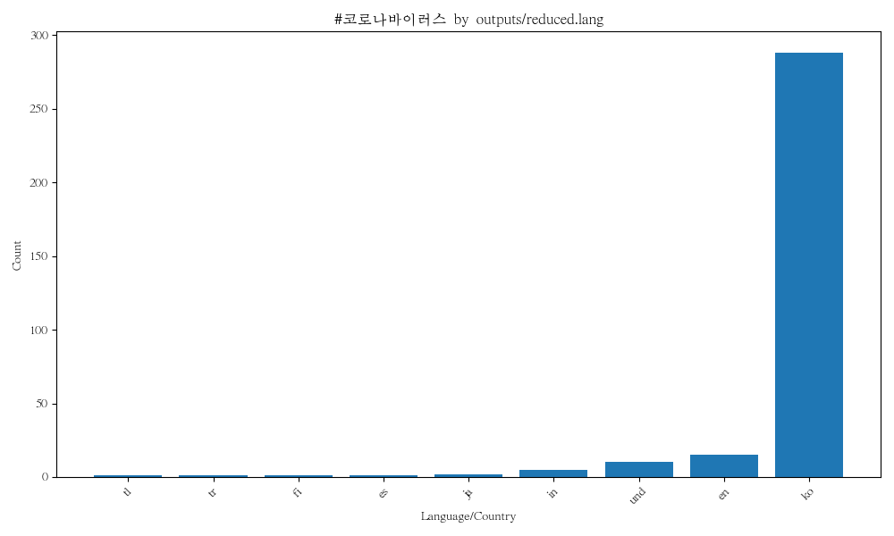
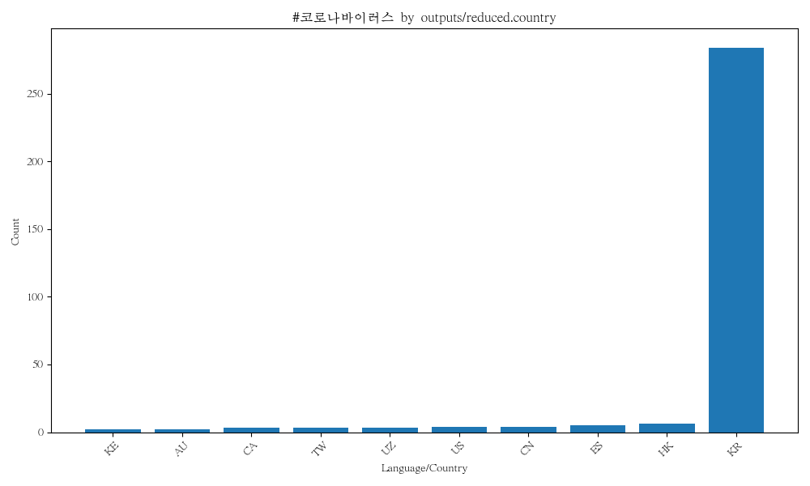
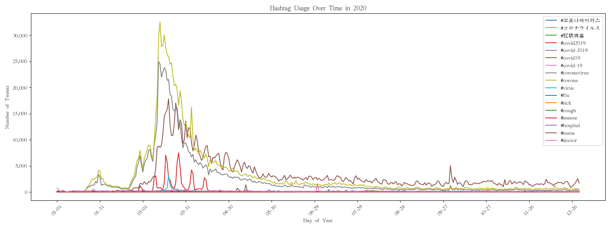

# Coronavirus Twitter Analysis

## Overview
This project analyzes approximately 1.1 billion geotagged tweets from 2020 to track the spread of coronavirus-related hashtags on social media. It uses the MapReduce paradigm to process the data in parallel, and Python to visualize the results.

## Technologies Used
- Python (MapReduce, data processing, visualization)
- Matplotlib (bar charts and line plots)
- Bash scripting (parallel job execution with `nohup` and `&`)

## How It Works

**`map.py`** processes each daily zip file and produces two output files per day:
- `.lang` file: counts per hashtag per language e.g. `{'#coronavirus': {'en': 5000, 'es': 10}}`
- `.country` file: counts per hashtag per country e.g. `{'#coronavirus': {'US': 4000, 'ES': 40}}`

**`reduce.py`** combines all 366 `.lang` files into one `reduced.lang` and all 366 `.country` files into one `reduced.country`, adding up the counts across all days to get the full year totals.

**`visualize.py`** takes the reduced files and plots the top 10 languages or countries for a specific hashtag as a bar chart.

**`alternative_reduce.py`** keeps each day separate to show how hashtag usage changed over time throughout 2020, generating a line plot with one line per hashtag.

## Visualizations

### #coronavirus by Language

### #coronavirus by Country

### #코로나바이러스 by Language

### #코로나바이러스 by Country

### Hashtag Usage Over Time

